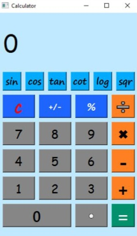

# Assignment 17

## Calculator

### How it works :

- This caculator has ability of four basic operators
- The other features is that you can calculate *sin* , *cos* , *tan* , *cot* , *log* , *sqrt*
- There is a buttton with sign of **.** which can used for float numbers
- The button with sign of **C** , clear the text box
- You can use percentage button to get percent of numbers
- With +/- button you can inverse input numbers


 ### Output :

 
 

### Installation guide
To execute this program you need to install two libraries

**pyside6** 

You can install them by using the *pip* command :

For instance :
**pip install pyside6**


## How To Run

To Run program , open your *cmd* or *Terminal* and enter this command :

```
python file_name.py
```
