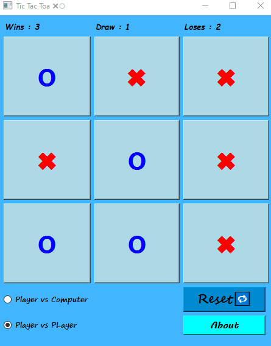

# Assignment 18

## Tic-Tac-Toa Game ⭕✖

### How it works :

- This game is a double player match
- In the beginning of the game you should choose you want to play with other user or with computer
- The sign of **✖** is belong to you & the sign of **⭕** is belong to your competitor
- There is scoreboard on top of the window what's show you the number of *Wins* , *Draws* , *Loses*
- If you click on **Reset** button , the match will be reset
- The **About** button give you a simple guide of game 


 ### Output :

 
 

### Installation guide
To execute this program you need to install two libraries

**pyside6** 

You can install them by using the *pip* command :

For instance :
**pip install pyside6**


## How To Run

To Run program , open your *cmd* or *Terminal* and enter this command :

```
python file_name.py
```
