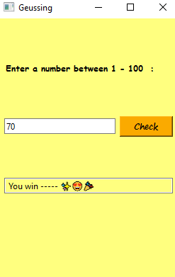

# Assignment 19

## Game of geussing numbers

### How it works :

- In the beginning of the game computer save a random number between 1 - 100
- You should try to geuss the number that computer save
- You can enter your geuss in white text-box and click on check
- After each try , in the lowest text-box apear a help massge
- If you can geuss number correctly , there will be winnig massage

 ### Output :

 
 

### Installation guide
To execute this program you need to install two libraries

**pyside6** 

You can install them by using the *pip* command :

For instance :
**pip install pyside6**


## How To Run

To Run program , open your *cmd* or *Terminal* and enter this command :

```
python geuss_numbers.py
```
which is the main file of Number geussing
