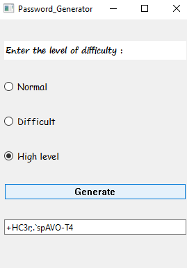

# Assignment 19

## Password generator

### How it works :

- There is three level to create password in this program :
  - Normal , which is including 8 character and combination of upper-case , lower-case
  - Difficult , which is including 12 character and combination of upper-case , lower-case , digits
  - High level , which is including 16 character and combination of upper-case , lower-case , digits , symbols
- You can choose one of those options and click on **Generate** to get a strong password
- If your password is hard to read or remember , you can click on *Generate* again to regeneration new one
   

 ### Output :

 
 

### Installation guide
To execute this program you need to install two libraries

**pyside6** 

You can install them by using the *pip* command :

For instance :
**pip install pyside6**


## How To Run

To Run program , open your *cmd* or *Terminal* and enter this command :

```
python main.py
```
which is the main file of Password generator
