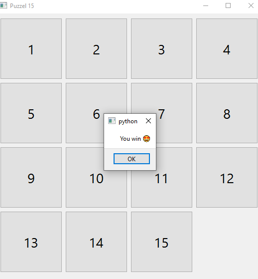

# Assignment 19

## Puzzel 15 Game

### How it works :

- There is 15 blocks on this game with random arrangement
- You should arrange them with moving one by one
- The point is that, you can just move that one which has empty space in contiguity
- When you arrange all of them from 1 to 15 , it'll be finish and you win the game .


 ### Output :

 
 

### Installation guide
To execute this program you need to install two libraries

**pyside6** 

You can install them by using the *pip* command :

For instance :
**pip install pyside6**


## How To Run

To Run program , open your *cmd* or *Terminal* and enter this command :

```
python main.py
```
which is the main file of Puzzel 15 
