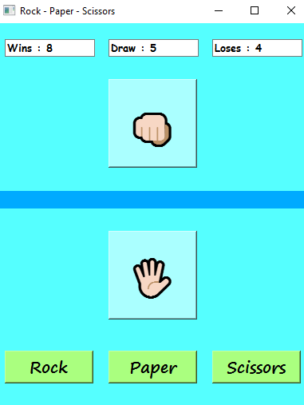

# Assignment 19

## Rock-Paper-Scissors Game 👊🏻🖐🏻✌🏻

### How it works :

- There is three buttons below of window which are allow you to choose you choice
- When you choose one of , computer automaticlly choose one of that three choices
- Each side get the score , it'll be show on scoreboard on top of the window


 ### Output :

 
 

### Installation guide
To execute this program you need to install two libraries

**pyside6** 

You can install them by using the *pip* command :

For instance :
**pip install pyside6**


## How To Run

To Run program , open your *cmd* or *Terminal* and enter this command :

```
python game.py
```
which is the main file of Rock-Paper-Scissors

