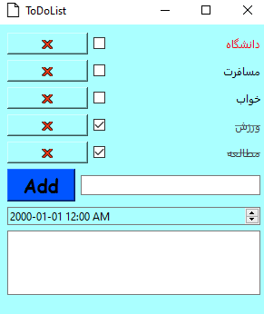

# Assignment 22

## ToDoList App

### What's there :

- There is a folder in this assignment
- What is relating to a exe file which can run this app diectly
- The library that I used to make that file is **Pyinstaller**
- --------------------------------------------------------------
- *main.py* file is relating to a ToDoList program which has a database 
- This file has these options :
  - Add tasks to database => Clicking on Add Button
  - Remove task => Clicking on ❌ Button
  - Show informatiom => CLicking on the title of task :
    - It will display you the description .
- With choose each of them you can make changes on your database .

 ### Output :

 


### Installation guide for python files
To execute this program you need to install a library

**Pyside6**  

You can install them by using the *pip* command :

For instance :
**pip install PySide6**


## How To Run

To run python files , open your *cmd* or *Terminal* and enter this command :
```
python main.py
```
