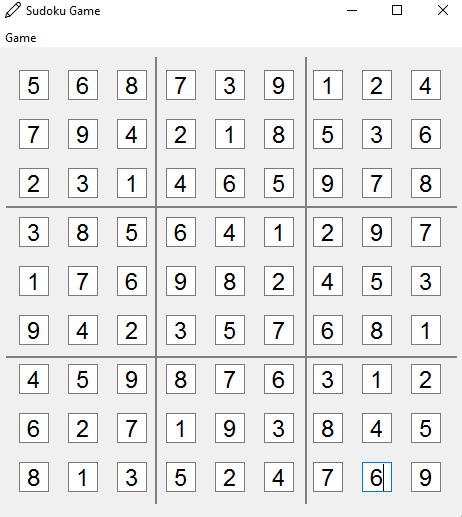

# Assignment 23

## Sudoku Game 

### What's there : 

- This assignment is relating to Sudoku game
- There are three python files :
  - The file with name of *main.py* is the main file to execute
  - *MainWindow.py* is converted file of *mainwindow.ui* => UI file
  - And *sudoku_grid.py* for subgrid sudoku board
- In menu of this game there are two choices :
  - 1-New game & 2-Open file
    - First option is for start a new game
    - *Open file* choice is because of entering your own numbers by text file
    - And the **file.txt** file is for this option
    - You can also upload your own files by that option
- If you make any mistake in numbers , program will display you an error
- Otherwise you will win , after completing the whole board and get congratulation message

 ### Output :

 


### Installation guide for python files
To execute this program you need to install a library

**Pyside6**  

You can install them by using the *pip* command :

For instance :
**pip install PySide6**


## How To Run

To run python files , open your *cmd* or *Terminal* and enter this command :
```
python main.py
```
