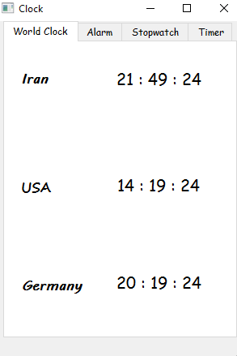
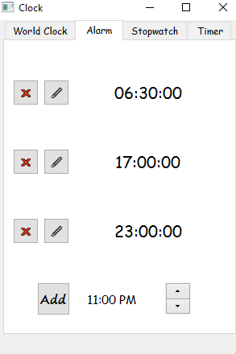
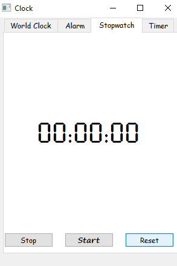
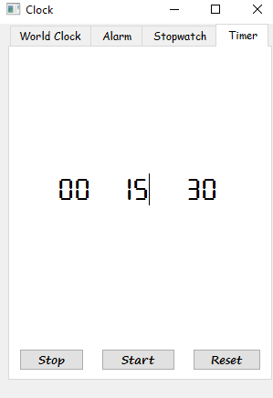

# Assignment 25

## Clock App

### What's there :

- There is a folder in this assignment with name of *dist*
- What is relating to a exe file which can run this app diectly
- The library that I used to make that file is **pyinstaller**
- --------------------------------------------------------------
- *main.py* file is relating to a Clock program which has a database for saving alarms
- This file has these sections :
  - World Clock: to disply time-zone of three country , Iran , USA and Germany
  - Alarm: to save user alarms in a database with these options :
    - Edit alarms by **🖊** pushbutton
    - Remove alarms by **❌** pushbutton
    - Add alarm by QTimeEdit widget
  - Stopwatch: measurement elapsed time with this buttons : *Stop* , *Start* and *Reset*
  - Timer: countdown until reach **00: 00 :00** and display *Time's up* message

 ### Outputs :

World-Clock :


Alarm :


Stopwatch :


Timer :

 

### Installation guide for python files
To execute this program you need to install a library

**Pyside6 , time , pytz , sys**  

You can install them by using the *pip* command :

For instance :
**pip install PySide6**


## How To Run

To run python files , open your *cmd* or *Terminal* and enter this command :
```
python main.py
```
